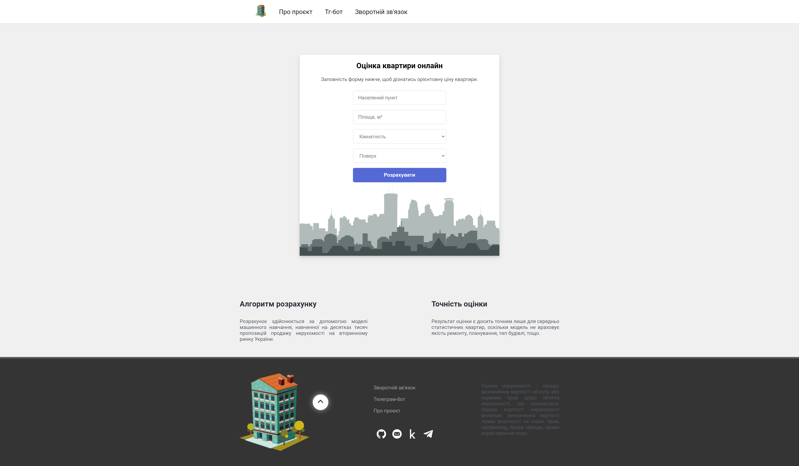

# Real Estate Price Prediction in Ukraine

Welcome to my pet project! This project is a flask app and telegram bot with an integrated machine learning model. A model based on XGBoost allows you to predict the cost of apartments in various cities of Ukraine based on features such as city, region, area, floor and number of rooms.

## Usage

### Requirements
* Docker Compose

### Setup
* Clone repository
```bash
  git clone https://github.com/Boohdaaaan/ML-Property-valuation.git
```

* Move to project folder
```bash
  cd ML-Property-valuation
```

* Set environment variables

Windows:
```bash
  set PASSWORD_EMAIL_APP=Gmail app password
  set API_TOKEN=Telegram bot API token
```
Linux:
```bash
  export PASSWORD_EMAIL_APP=Gmail app password
  export API_TOKEN=Telegram bot API token
```

* Start the project
```bash
  docker compose up --build
```

### How to Interact with the Project
Open the web application in your browser by visiting http://localhost:5000/.  
Enter the necessary parameters of the real estate property (city, region, area, floor, and number of rooms) and click the "Predict" button.  
To use the Telegram bot, find it on Telegram by its name and start a dialogue with it. The bot will ask you for the required property features and will send back the predicted price in response.

### Data
The dataset used for this project was scraped from the most popular real estate listings website in Ukraine.  
Before training the XGBoost model, the data underwent thorough preprocessing.  
1. Data cleaning was performed to correct any errors in the dataset.
2. Outliers were removed to improve the model's robustness.
3. Feature selection was conducted to identify the most relevant attributes for predicting real estate prices.

### ML Model
In this project, I employed the XGBoost machine learning model.  
To optimize the model's performance and achieve the best results, I used the Optuna library for hyperparameters tuning. This process allowed me to fine-tune the model on optimal hyperparameters, leading to improved prediction quality.

### Docker
For a convenient deployment in the future, I used Docker Compose. My project has two Dockerfiles and a docker-compose.yml.
Dockerfile create docker image, define settings and environments inside a container.
docker-compose.yml defines the services to be started, environment and network settings.

# Screenshots
### Main page: predicting real estate prices.


### Complete the form below to receive an estimate of the apartment's cost.


### Have a look at the price prediction.


### Contact form for your questions and suggestions!

